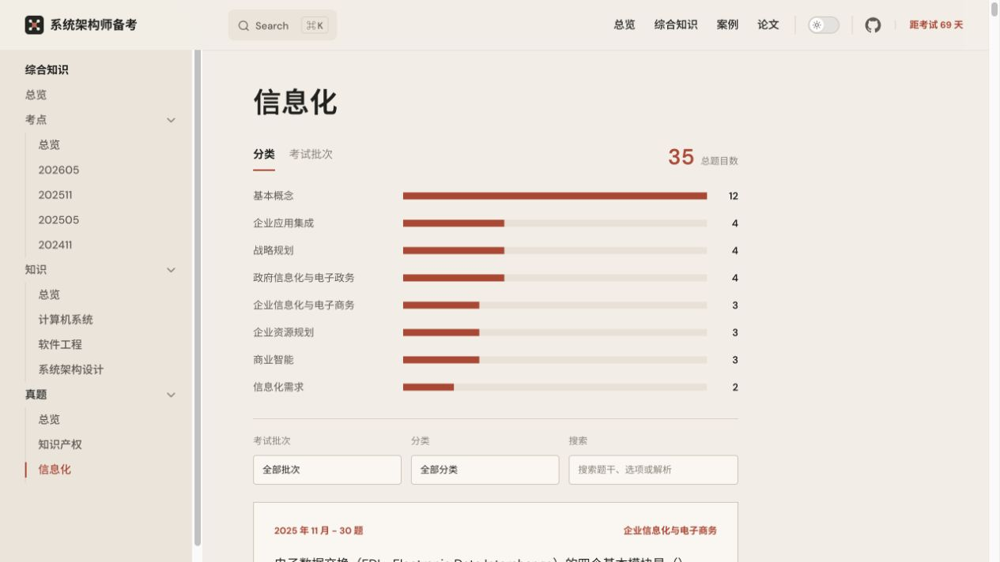

# 系统架构师备考

系统架构设计师备考学习站。项目以考试考点为主线，结合知识讲解、历年真题和考情分析，帮助按模块复习和练习。

在线访问：[系统架构师备考学习站](https://mewcoder.github.io/system-architect-ai/)

## 页面预览



## 内容模块

- **总览**：考试介绍、复习入口和历年考情分析。
- **综合知识**：计算机系统基础知识、软件工程、系统架构设计和其他专题。
- **案例**：案例分析的考点、知识和历年真题。
- **论文**：论文写作的考点、知识和历年真题。

综合知识目前按以下思路组织：

```text
综合知识
├── 计算机系统基础知识
│   ├── 硬件与嵌入式
│   ├── 操作系统
│   ├── 计算机网络
│   ├── 数据库系统
│   └── 其他
├── 系统架构设计
│   ├── 架构基础与 4+1 视图
│   ├── ABSD、架构风格与质量属性
│   ├── 架构评估、复用与 DSSA
│   └── 微服务、分布式与新技术架构
├── 软件工程
│   ├── 基础与过程管理
│   ├── 需求与分析建模
│   ├── 系统设计与设计模式
│   ├── 构件化与软件复用
│   ├── 软件测试与可靠性
│   └── 软件运行与维护
└── 其他专题
    ├── 信息安全、项目管理
    ├── 企业信息化战略、知识产权
    └── 数学与经济管理、专业英语
```

每个模块根据内容提供相应的知识页、考点分析页或真题页。真题页面支持按考试批次、分类筛选和关键词搜索，作答后会即时显示答案与解析。

## 本地运行

环境要求：Node.js `>=20 <23`，npm `>=10`。

```bash
npm install
npm run docs:dev       # 启动本地开发服务
npm run docs:build     # 构建静态站点
npm run docs:preview   # 预览构建结果
```

项目使用 VitePress，推送到 `main` 分支后由 GitHub Actions 构建并部署到 GitHub Pages。

## 项目结构

```text
docs/
├── .vitepress/                # VitePress 配置、主题和页面组件
├── data/                      # 线上页面使用的题库与考点 JSON
├── general/                   # 综合知识页面
├── case/                      # 案例页面
├── thesis/                    # 论文页面
└── public/assets/             # 页面图片等静态资源
local/                         # 本地资料、数据库和处理脚本，不提交
share/                         # 资料暂存目录
temp/                          # PDF 转换、渲染和验证临时文件
```

线上题库统一放在 `docs/data/question-banks/`，页面直接读取 JSON，不依赖后端服务。`local/`、`temp/` 和 `output/` 用于本地资料或处理中间结果，不作为网站构建数据源。
